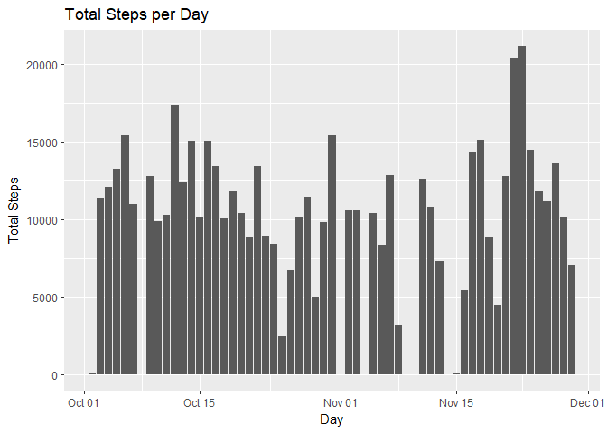
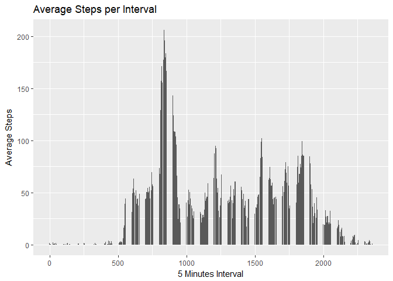
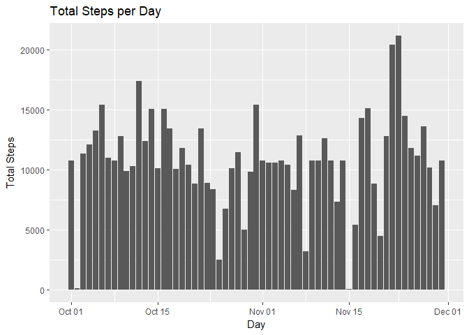
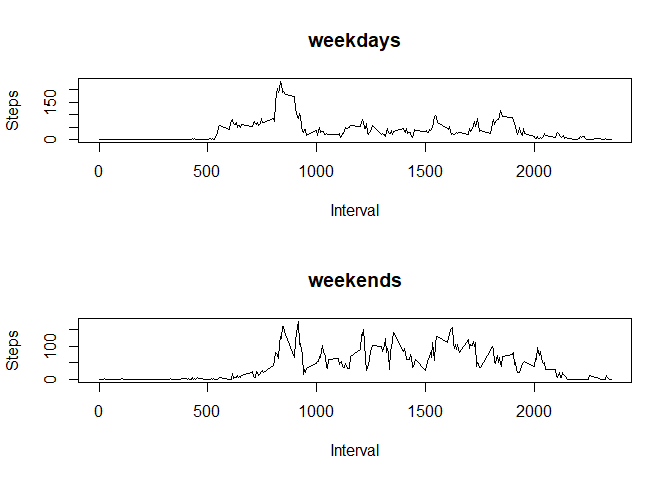

## Loading and preprocessing the data
Data is imported, the NA values are removed and date is stored as date format.

```r
data <- read.csv("C:/Users/aeraf/Documents/Coursera/RepData_PeerAssessment1/activity/activity.csv", header = TRUE)
cleanData <- data[complete.cases(data),]
cleanData$date <- as.Date(cleanData$date)
head(cleanData)
```

```
##     steps       date interval
## 289     0 2012-10-02        0
## 290     0 2012-10-02        5
## 291     0 2012-10-02       10
## 292     0 2012-10-02       15
## 293     0 2012-10-02       20
## 294     0 2012-10-02       25
```


## What is mean total number of steps taken per day?
The steps are aggregated by day, returning the total number of steps per day. This 
information is ploted and the mean and median value of steps per day are calculated.

```r
library(ggplot2)
dayAggregatedData <- aggregate(cleanData$steps, list(Day = cleanData$date), FUN = "sum")
ggplot(dayAggregatedData, aes(x = Day, y = x)) + geom_bar(stat = "identity") + xlab("Day") + ylab("Total Steps") + ggtitle("Total Steps per Day")
```

<!-- -->

```r
meanSteps <- as.integer(summary(dayAggregatedData$x)["Mean"])
meanSteps
```

```
## [1] 10766
```

```r
medianSteps <- as.integer(summary(dayAggregatedData$x)["Median"])
medianSteps
```

```
## [1] 10765
```


## What is the average daily activity pattern?
The steps average by time interval of the day  is plotted below.

```r
intervalAggregatedData <- aggregate(cleanData$steps, list(Interval = cleanData$interval), 
                                    FUN = "mean")
ggplot(intervalAggregatedData, aes(x = Interval, y = x)) + geom_bar(stat = "identity") + xlab("5 Minutes Interval") + ylab("Average Steps") + ggtitle("Average Steps per Interval")
```

<!-- -->

The interval with the maximum value of average steps and the value of the average are
shown below:

```r
intervalAggregatedData <- aggregate(cleanData$steps, list(Interval = cleanData$interval),
                                    FUN = "mean")
#Interval with the maximum average
intervalAggregatedData[intervalAggregatedData$x==max(intervalAggregatedData$x),"Interval"]
```

```
## [1] 835
```

```r
#Maximum average of steps by interval
intervalAggregatedData[intervalAggregatedData$x==max(intervalAggregatedData$x),"x"]
```

```
## [1] 206.1698
```


## Imputing missing values
The total number of NA values is calculated below.

```r
naRows <- is.na(data$steps)
sum(naRows)
```

```
## [1] 2304
```
The data is completed using the average of the interval to replace the NA value.

```r
completedData <- data
completedData$date <- as.Date(data$date)
for (i in seq(nrow(completedData))){
    if (naRows[i]){
        completedData[i,"steps"] <- intervalAggregatedData[intervalAggregatedData$Interval
                                                           == completedData[i,"interval"],
                                                           "x"]
    }
}
```
The steps are aggregated by day, returning the total number of steps per day. This 
information is ploted and the mean and median value of steps per day are calculated for
the new data.

```r
library(ggplot2)
dayAggregatedData2 <- aggregate(completedData$steps, 
                                list(Day = completedData$date), FUN = "sum")
ggplot(dayAggregatedData2, aes(x = Day, y = x)) + geom_bar(stat = "identity") + xlab("Day") + ylab("Total Steps") + ggtitle("Total Steps per Day")
```

<!-- -->

```r
meanSteps2 <- as.integer(summary(dayAggregatedData2$x)["Mean"])
meanSteps2
```

```
## [1] 10766
```

```r
medianSteps2 <- as.integer(summary(dayAggregatedData2$x)["Median"])
medianSteps2
```

```
## [1] 10766
```
Original values without completing NA values for comparison.

```r
meanSteps
```

```
## [1] 10766
```

```r
medianSteps
```

```
## [1] 10765
```
No relevant differences found in the original data and the completed data.


## Are there differences in activity patterns between weekdays and weekends?
First, the weekday is appended to the dataframe. Then the dataframe is splitted into
weekdays and weekends.

```r
cleanData$weekday <- weekdays(cleanData$date)
head(cleanData)
```

```
##     steps       date interval weekday
## 289     0 2012-10-02        0 Tuesday
## 290     0 2012-10-02        5 Tuesday
## 291     0 2012-10-02       10 Tuesday
## 292     0 2012-10-02       15 Tuesday
## 293     0 2012-10-02       20 Tuesday
## 294     0 2012-10-02       25 Tuesday
```

```r
cleanData[cleanData$weekday=="Monday" |
              cleanData$weekday=="Tuesday" |
              cleanData$weekday=="Wednesday" |
              cleanData$weekday=="Thursday" |
              cleanData$weekday=="Friday", "weekday"] = "weekday"
cleanData[cleanData$weekday=="Saturday" |
              cleanData$weekday=="Sunday", "weekday"] = "weekend"
```

Plot comparison with the average number of steps by interval for weekdays and weekends.

```r
weekdayData <- cleanData[cleanData$weekday == "weekday",]
weekendData <- cleanData[cleanData$weekday == "weekend",]
intervalAggregatedWeekdayData <- aggregate(weekdayData$steps, 
                                           list(Interval = weekdayData$interval),
                                           FUN = "mean")
intervalAggregatedWeekendData <- aggregate(weekendData$steps, 
                                           list(Interval = weekendData$interval),
                                           FUN = "mean")
par(mfrow=c(2,1))
plot(intervalAggregatedWeekdayData, type = "l", ylab = "Steps", main = "weekdays")
plot(intervalAggregatedWeekendData, type = "l", ylab = "Steps", main = "weekends")
```

<!-- -->
